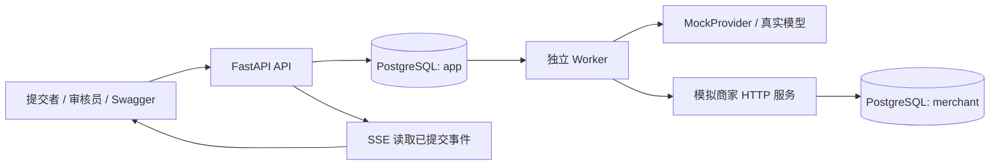

# Aftercare Agent 项目设计文档

版本：1.0 审阅稿\
日期：2026-09-18\
状态：等待项目所有者审阅；本轮仅交付文档，不代表已授权实现或发布。\
定位：参考 nanobot 的小型任务型 Agent 后端，以模拟售后退款验证人工审批、故障恢复和副作用幂等。

## 1. 项目目标与范围

### 1.1 一句话说明

用户提交订单售后问题，Agent 查询订单、物流和规则，提出处理方案；退款方案经人工审批后，由确定性执行器调用模拟商家服务。即使 Worker 崩溃、请求超时或审批重复提交，系统仍能恢复任务并避免重复退款。

这里的退款规则仅是项目自定义的演示规则，不是现实中的法律、商家条款或支付系统规则。所有订单、客户和资金均为模拟数据。

### 1.2 用户与业务价值

| 角色 | 需要解决的问题 | 交付结果 |
| --- | --- | --- |
| 工单提交者 | 用自然语言描述问题，不必自己逐项查订单和物流 | 工单状态、调查依据、处理结果 |
| 售后审核员 | 判断建议是否合理，明确批准的金额和订单 | 可审阅的结构化方案和审批记录 |
| 后端开发者 | 长任务、人工暂停与外部操作失败难以正确组合 | 可重放步骤、可靠执行规则、故障测试 |

Agent 的职责是选择查询顺序、组织资料、解释方案。后端负责身份、金额、资格、授权及实际退款。不能依靠提示词限制代替后端规则。

### 1.3 MVP 必做

- 一个场景：已支付、物流延误订单的一次性全额模拟退款。
- 一个 Agent，三个只读工具：订单、物流、售后规则查询。
- 两种 Agent 最终建议：`recommend_refund`、`no_action`。
- 持久化任务及已完成步骤，独立 Worker 领取和恢复任务。
- 人工批准或拒绝；重新调查使旧方案及旧审批失效。
- 审批版本绑定、幂等请求、外部操作对账、重复退款防护。
- REST API、Swagger、SSE 步骤事件、命令行演示。
- 默认确定性模拟模型；可配置真实工具调用模型。
- PostgreSQL 集成测试、真实进程故障演示、固定评测样本。

### 1.4 明确不做

真实支付、真实订单接入、多租户、注册登录、复杂 RBAC、多轮客服聊天、部分退款、多币种、自动退款审批、批量退款、撤销已批准执行、通用 DAG 编辑器、多 Agent、长期记忆、RAG、MCP 插件市场、定时巡检、Redis、消息中间件、Kubernetes、自定义前端。

`manual_review` 只作为需要人工核对的冻结结果展示，MVP 不做后台强制改状态或补账接口。用户审阅后如需增加功能，应单独修改范围，不能由执行 Agent 顺手扩充。

### 1.5 项目规模

一个代码仓库、一个 Python 应用镜像，三个运行角色：API、Worker、模拟商家；加一个 PostgreSQL 容器。模拟商家是测试外部 HTTP 边界的小服务，不建设微服务平台。

先前的行数和工期仅是粗估。完整可靠性测试可能使总量超出 4,000 行，不为了凑行数删掉事务校验或测试。范围控制以本节功能清单为准；按 6 个可独立验收的里程碑推进，不承诺固定天数。

## 2. 可借鉴项目与原创边界

资料核查日期为 2026-09-18。下面的链接用于理解机制；依赖安装与代码许可在执行时再次核对。项目规模和适用性不由 Star 数单独决定。

| 来源 | 阅读位置 | 借鉴什么 | 本项目如何使用 |
| --- | --- | --- | --- |
| [HKUDS/nanobot](https://github.com/HKUDS/nanobot) | [架构说明](https://github.com/HKUDS/nanobot/blob/main/docs/architecture.md)，`nanobot/agent/runner.py`、`context.py`、`tools/registry.py` | 区分会话编排与模型/工具循环；工具有明确名称、Schema；工具结果返回模型 | 主要学习来源；独立实现小型 `runner`、`provider`、`tools`，不安装整个 nanobot，不搬运 IM、记忆、桌面等模块 |
| [LangGraph](https://github.com/langchain-ai/langgraph) | [Interrupts](https://docs.langchain.com/oss/python/langgraph/interrupts)、[Durable execution](https://docs.langchain.com/oss/python/langgraph/durable-execution) | 人工中断必须持久化；恢复不等于从原内存位置继续；重跑区域要管理副作用 | 用显式任务状态与审批表表达暂停；MVP 不再引入第二套工作流运行时 |
| [DBOS Python](https://github.com/dbos-inc/dbos-transact-py) | [Architecture](https://docs.dbos.dev/architecture) | 已完成步骤结果持久化，崩溃恢复时重用结果；未完成外部调用仍可能重复 | 参考 checkpoint/step ledger 思路，限定为两个业务阶段，不仿写通用 DBOS |
| [PostgreSQL 16](https://www.postgresql.org/docs/16/sql-select.html) | `FOR UPDATE SKIP LOCKED`、[事务隔离](https://www.postgresql.org/docs/16/transaction-iso.html) | 多 Worker 竞争领取、短事务、行锁和唯一约束 | 直接依赖 PostgreSQL；任务表兼任小规模持久队列 |
| [Stripe 幂等请求文档](https://docs.stripe.com/api/idempotent_requests) | 幂等键与参数一致性 | 客户端为同一操作复用键，不能每次网络重试生成新键 | 仅借鉴协议；本项目自建模拟商家，不接 Stripe，不照搬其保留时间或错误缓存语义 |

nanobot 官方架构当前把 `AgentLoop` 与 `AgentRunner` 分开；它的会话存储设计不等于本项目要求的退款事务协议。不能在文档或简历中称“nanobot 原生保证退款不重复”。

本项目不是新的客服产品或新 Agent 算法。独立实现部分是：工单状态协议、不可变审批对象、退款操作账本、租约校验、故障恢复及验证证据。使用已有框架本身不构成创新。若复制任何源码，记录来源文件与 commit，并按对应许可证保留声明；默认只借鉴结构。

相近案例也应如实写入最终 README：[Swarm 退款分流示例](https://github.com/openai/swarm/blob/main/examples/triage_agent/agents.py) 已有退款 Agent，但工具只是模拟输出；[LangGraph 客服教程固定版本](https://github.com/langchain-ai/langgraph/blob/23961cff61a42b52525f3b20b4094d8d2fba1744/docs/docs/tutorials/customer-support/customer-support.ipynb) 已演示只读/敏感工具分开及人工确认。它们是功能先例，不能代替本项目的跨 HTTP 故障测试。

## 3. 技术选型与架构

### 3.1 技术约束

- Python 3.12；FastAPI；Pydantic 2；SQLAlchemy 2；psycopg 3 异步驱动；Alembic。
- PostgreSQL 16；应用事务隔离级别为 `READ COMMITTED`。
- HTTP 使用 httpx，所有调用设明确超时，禁止库层隐式无限重试。
- 使用 uv 管理环境并提交 `uv.lock`；执行时选择支持以上主版本的稳定依赖并锁定，不在设计中虚构最新小版本。
- pytest、pytest-asyncio、Ruff；HTTP 单元测试使用 httpx 的可控 transport。
- Docker Compose 是跨 Windows/Linux 的标准验收环境。Windows 开发宿主可用 PowerShell；容器运行 Linux。
- 全部时间使用 PostgreSQL UTC `timestamptz`；金额使用整数分，禁止 float。
- 只绑定本机对外端口；MVP 不做公网部署。

### 3.2 组件图



`app`、`merchant` 位于同一个 PostgreSQL 实例的两个 schema，使用不同数据库角色和独立事务。应用角色不能访问商家表，商家角色不能访问应用表。共享数据库实例是降低部署成本，不代表跨服务原子提交或跨故障域高可用。

API 只写任务、审批和事件，不执行 LLM 或退款。Worker 不直接写模拟商家表，所有业务访问通过 HTTP。模拟商家拥有最终退款账本和订单版本。

### 3.3 为什么这样选

固定业务阶段足以表达本项目；PostgreSQL 领取任务便于展示事务与恢复，无须增加 Redis。自主模型决策保留在调查阶段，执行退款阶段完全确定化，避免恢复时重新生成金额或改变已批准内容。

LangGraph、DBOS 是可靠替代方案，但本设计选择显式实现小型业务状态机，以便研究正确性。执行者不能再叠加 Celery、Temporal 或 LangGraph；未来可另开对比实验。

## 4. 业务规则与演示数据

### 4.1 身份

本地环境用三个 Bearer Token：`CLIENT_TOKEN` 映射 `customer_demo`，`REVIEWER_TOKEN` 映射 `reviewer_demo`，`MERCHANT_TOKEN` 用于 Worker 访问模拟商家。Token 来自环境变量且不能相同。

请求体不能指定自己的角色、客户 ID 或审核人。API 根据 Token 建立 actor；提交者只能读自己的任务和订单，审核员可以读所有任务及审批。无效 Token 返回 401；角色不允许返回 403；不可见任务或订单返回 404。

这是单租户演示鉴权，不是完整用户系统。模拟订单不含真实个人信息；用户输入和工具内容不得写入未经裁剪的公共日志。

### 4.2 唯一退款规则 `refund_v1`

必须同时满足：订单属于当前提交者，`payment_status=paid`，`shipment_status=delayed`，`delay_days >= 7`，`currency=CNY`，`0 < paid_amount_cents <= 100000`，且从未成功退款。

退款金额只能等于 `paid_amount_cents`。所有退款均需审批。订单与物流共用单调递增的 `order_version`，任一影响资格的字段变更都递增版本。规则版本为固定 `refund_v1`，MVP 无规则编辑界面。

金额、客户、订单版本、规则版本从校验通过的查询快照派生，不接受模型提供的覆盖值。商家在实际执行时重新校验这些条件，并比较 `expected_order_version`。

### 4.3 种子数据

| 订单 | 所属客户 | 金额分 | 物流 | 预期 |
| --- | --- | ---: | --- | --- |
| `ORD-1001` | `customer_demo` | 19900 | delayed，延误 8 天 | 可提出退款审批 |
| `ORD-1002` | `customer_demo` | 9900 | delivered，延误 0 天 | 规则拒绝退款 |
| `ORD-1003` | `customer_demo` | 29900 | delayed，延误 2 天 | 规则拒绝退款 |
| `ORD-1004` | `customer_demo` | 19900 | delayed，延误 8 天，已退款 | 不产生第二次退款 |
| `ORD-1005` | `customer_other` | 19900 | delayed，延误 8 天 | 对提交者不可见 |
| `ORD-1006` | `customer_demo` | 120000 | delayed，延误 8 天 | 超出规则金额上限 |

所有初始版本为 1，已退款订单对应商家账本必须一并存在。seed 默认只插入缺失记录，不清空或覆盖已运行数据。集成测试使用独立测试库和生成的订单 ID；重复演示通过创建新模拟订单，不删除历史退款来伪造结果。

## 5. Agent 契约

### 5.1 输入与工具

创建任务时 `order_id` 固定，`message` 长度 1～2000 字符。Agent 上下文只包含系统规则、当前工单、当前 generation 已提交的查询结果和有限工具错误，不混入其他任务记录。

| 工具 | 模型参数 | 返回 | 数据来源 |
| --- | --- | --- | --- |
| `get_order` | 空对象 | owner、paid_amount_cents、currency、payment_status、refunded、order_version | 商家 HTTP |
| `get_shipment` | 空对象 | shipment_status、delay_days、order_version | 商家 HTTP |
| `get_refund_policy` | 空对象 | 固定 refund_v1 规则 | 本地确定性模块 |

工具包装器从任务读取 `order_id` 和 `customer_id`，模型不能查询另一订单。Pydantic 参数使用 `extra='forbid'`。工具错误是类型化结果，禁止拼接原始异常或连接字符串。模型看不到 `execute_refund`、SQL、shell 或任意 URL 工具。

### 5.2 Provider 边界

`ModelProvider.next_action(messages, tool_specs) -> ToolAction | FinalAction`，一次只允许一个工具调用，禁止并行 tool calls。Provider 使用工具调用响应表达 `ToolAction`，使用经 Pydantic 校验的最终 JSON 表达 `FinalAction`。

```json
{
  "kind": "final",
  "recommendation": "recommend_refund",
  "summary": "订单已延误八天，建议按规则提交全额退款审批。",
  "evidence_step_ids": ["step-order-uuid", "step-shipment-uuid", "step-policy-uuid"]
}
```

字段枚举固定，summary 限 500 字符；证据必须指向本 task、本 generation 的已成功只读步骤，ID 唯一。退款建议必须包含三类证据且订单/物流版本一致。金额、审批对象和资格由 `validate_proposal` 生成，模型不输出执行参数。

最终 `no_action` 也必须完成三类查询，使演示结果能由规则和事实解释。规则不满足时，后端生成固定理由；模型错误建议退款不能绕过规则。合法退款建议进入审批，`no_action` 结束为 `succeeded/no_action`；规则拦截的退款建议结束为 `rejected/POLICY_DENIED`。

查询遇到版本不一致时，返回 `INCONSISTENT_SNAPSHOT` 给模型并允许重新查询；达到预算仍不一致时 `failed/SNAPSHOT_UNSTABLE`。模型输出缺失/非法工具、错误 JSON 或假证据时，最多给一次纠正机会，之后 `failed/INVALID_MODEL_OUTPUT`。

### 5.3 预算

每 generation 最多 8 次实际模型请求、6 次工具逻辑调用，每个逻辑调用最多 3 次 HTTP 尝试；全任务最多 3 个 generation。模型请求硬超时 30 秒，读取工具 5 秒。LLM 的 429、5xx、网络错误最多重试 2 次，间隔 1 秒、3 秒，重试也扣模型预算。

预算在调用前持久化预扣。步骤的尝试数跨 Worker 恢复继续累计；不得重启后归零。单 generation 调查墙钟预算 180 秒，从本代第一次领取开始，包含恢复等待，不包含审批等待。

计数口径必须分开：model_call_count 在每次实际模型 HTTP 请求前加一；tool_call_count 只在创建新的工具逻辑步骤时加一；恢复同一个 pending 工具步骤只增加该 step 的 attempt_count，不再扣一次逻辑工具额度。get_refund_policy 是本地调用，不消耗 HTTP 尝试，但仍占一次工具逻辑调用。网络重试、Worker 恢复都不能超过该步骤尝试上限；纠正模型格式也计入模型调用预算。每次调用的有效超时取配置超时与本代剩余墙钟时间的较小值。

MockProvider 走相同 provider、工具、状态机接口，默认按固定顺序查询三个工具并输出可控建议。它是离线演示，不代表真实模型效果。真实模型只通过环境配置接入；未配置时不发送外部模型请求。

### 5.4 不记录隐藏推理

存储工具名称、裁剪后的参数/结果、决策类型和面向用户的简短说明。无需请求、保存或展示模型隐藏思维链。工具文本和用户文本视作数据；即使其中出现“无需审批”等内容，也不能改变执行权限。

## 6. 状态机

### 6.1 任务状态

`phase` 为 `investigate` 或 `execute_refund`；`status` 与 phase 分开，禁止用一个 `running` 猜测当前执行位置。

| 当前状态 | 触发 | 下一状态 / phase |
| --- | --- | --- |
| 无 | 创建成功 | queued / investigate |
| queued | Worker 原子领取 | running / 原 phase |
| running/investigate | 已验证退款建议 | waiting_approval / investigate |
| running/investigate | no_action | succeeded / investigate |
| running/investigate | 规则拒绝 | rejected / investigate |
| running/investigate | 调查失败或预算耗尽 | failed / investigate |
| waiting_approval | 批准当前版本 | queued / execute_refund |
| waiting_approval | 拒绝、过期 | rejected / investigate |
| waiting_approval | 重新调查 | queued / investigate，generation + 1 |
| running/execute_refund | 商家确认成功 | succeeded / execute_refund |
| running/execute_refund | 商家确定拒绝且无该操作副作用 | rejected / execute_refund |
| running/execute_refund | 结果无法确定、对账预算耗尽 | manual_review / execute_refund |
| running | 可重试的暂时故障 | queued / 原 phase，设置 next_run_at |
| running 且租约过期 | 新 Worker 接管 | running / 原 phase，lease_epoch + 1 |

`succeeded/rejected/failed/manual_review` 为 MVP 终态。`failed` 只能用于尚未冻结退款操作的失败；一旦操作存在且外部结果不确定，必须走 `manual_review`。过期扫描由 Worker 每 5 秒执行，只锁定 waiting_approval 或 queued/execute_refund 且尚无 operation 的任务；running 的有效租约由当前 Worker 自己处理授权过期。扫描不能抢写有效运行任务或触碰正在对账的操作。

### 6.2 人工审批

每代最多一个 approval。状态为 `pending/approved/rejected/expired/invalidated`，`(task_id, generation)` 唯一。

不可变 payload 包含：`task_id`、`generation`、`customer_id`、`order_id`、`amount_cents`、`currency`、`order_version`、`policy_version`、`evidence_step_ids`。

`payload_hash = SHA256(UTF8(json.dumps(payload, sort_keys=True, separators=(',', ':'), ensure_ascii=False, allow_nan=False)))`；证据 ID 去重排序，类型全部固定，金额是 int。hash 是版本一致性校验，不是数字签名或用户身份凭证。

有效期为生成后 24 小时。批准请求必须携带 `approval_id/generation/payload_hash`。API 锁定 task，再锁 approval，在一个事务内验证并完成批准、task 转 queued/execute_refund、事件写入。

批准后不存在编辑或撤回接口。冻结退款操作前再次检查授权未过期；冻结成功后不因审批过期而停止对账。这样不会让“实际已退款，但审批过期”变成悬空操作。

`reassess` 只允许在 `waiting_approval` 调用，锁 task 后将旧 approval 标为 invalidated，generation 加一，保留旧步骤，清空当前上下文和当前方案，再排队。原订单、客户和原始 message 不变。最多 3 代；不同 message 应创建新工单。

重新调查事务同时令 model_call_count/tool_call_count=0、generation_started_at=NULL，初始化本代 checkpoint 的 messages、evidence_by_tool 为空，next_step_no=1、invalid_output_count=0。next_run_at 设数据库当前时间、lease_owner/expiry 清空，lease_epoch 加一。只有新 generation 才重置本代预算，同代崩溃恢复不能重置。

审批与 reassess 竞争时，先提交者获胜；后者得到 409。已批准执行阶段不能重新调查。API 返回的历史审批记录仍可查询，但不能用旧 generation 批准新方案。

### 6.3 退款操作

操作状态为 `prepared/unknown/confirmed/declined`。

- `prepared`：已在数据库事务中冻结有效审批和不可变请求；这是执行授权的线性化点。
- `unknown`：已预登记一次外部尝试，但可能还未发送，也可能已经完成；不能凭状态判断资金是否变化。
- `confirmed`：查询或调用返回经校验的成功账本结果。
- `declined`：商家对本键给出稳定、明确的拒绝结果。

不单独建立会丢失含义的 `sending` 状态；所有没有可靠结果的发送窗口都按可能产生副作用处理。

## 7. 数据库设计

以下字段是实现契约；时间字段非特殊说明均非空，JSON 使用 JSONB。UUID 在应用中生成。状态使用字符串加 CHECK 约束，避免迁移 PostgreSQL enum 的额外复杂度。

### 7.1 app.tasks

| 字段 | 类型 / 约束 | 用途 |
| --- | --- | --- |
| id | uuid PK | 工单 ID |
| customer_id | text | 提交者身份 |
| order_id, message | text | 固定业务输入 |
| status, phase | text CHECK | 第 6 节状态 |
| generation | int，1～3 | 当前方案代数 |
| checkpoint | jsonb | schema_version=1、本代已提交 messages、证据索引、下一 step_no；初始空上下文 |
| model_call_count, tool_call_count | int >= 0 | 本代累计预算 |
| generation_started_at | timestamptz nullable | 本代第一次领取时设置；后续不重置 |
| next_run_at | timestamptz | 可领取时间 |
| lease_owner | text nullable | Worker 实例 ID |
| lease_epoch | bigint >= 0 | 每次领取加一 |
| lease_expires_at | timestamptz nullable | 租约期限 |
| last_event_seq | bigint >= 0 | 本任务事件序号 |
| result | jsonb nullable | outcome、refund_id 或 no_action 说明 |
| error_code, error_detail | text nullable | 有界、已脱敏的错误 |
| created_at, updated_at | timestamptz | 生命周期 |

索引：`(status,next_run_at,created_at)`、`(status,lease_expires_at)`、`(customer_id,created_at,id)`。CHECK：running 必须有 owner/expiry，其余状态 owner/expiry 为空。

### 7.2 app.steps

字段：`id uuid PK`、`task_id FK`、`generation int`、`step_no int`、`kind text(model/tool)`、`name text`、`status text(pending/succeeded/failed)`、`attempt_count int`、`input jsonb`、`output jsonb nullable`、`error_code nullable`、`started_at`、`completed_at nullable`。

唯一键 `(task_id,generation,step_no)`。模型下一动作和工具结果都是可持久化步骤；模型已提交选择但工具未完成时，应恢复工具步骤，不能重新问模型并换工具。

工具结果序列化最多 16 KiB；模型输出最多 8 KiB；checkpoint 最多 128 KiB。超限返回类型化错误，不把任意内容塞进数据库。无完整快照压缩或自动长期记忆。

checkpoint v1 固定包含 `schema_version=1`、`generation`、`messages`、`next_step_no`、`evidence_by_tool`、`invalid_output_count`。最后一个字段持久化本代模型纠正次数，防止重启后反复获得纠正额度。旧 generation 的证据仍在 steps 表中，但不得进入当前 evidence_by_tool。

### 7.3 app.approvals

字段：`id uuid PK`、`task_id FK`、`generation int`、`status`、`payload jsonb`、`payload_hash char(64)`、`summary text`、`expires_at`、`decision_key nullable`、`decision_hash nullable`、`decided_by nullable`、`decided_at nullable`、`created_at`。

UNIQUE(task_id,generation)。payload 和 summary 写入后不可编辑；只更新状态和决定元数据。生成审批、任务进入 waiting_approval、事件写入在同一事务完成。

### 7.4 app.refund_operations

字段：`id uuid PK`、`task_id uuid UNIQUE FK`、`approval_id uuid UNIQUE FK`、`order_id text`、`generation int`、`operation_key text UNIQUE`、`request jsonb`、`request_hash char(64)`、`status`、`dispatch_count int`、`reconcile_count int`、`reconcile_deadline timestamptz`、`merchant_refund_id nullable`、`merchant_result jsonb nullable`、`last_error_code nullable`、`created_at`、`updated_at`。

`operation_key = 'refund:' + task_id + ':' + generation`。请求固定为 `order_id/customer_id/amount_cents/currency/expected_order_version/policy_version/authorization_id`，authorization_id 为 approval_id。prepared 创建后禁止修改 key、request、request_hash、approval_id。

任务和操作必须锁定同一 task 行后再修改；成功/拒绝的操作结果、任务终态、事件必须同事务提交。MVP 每个工单至多一个实际退款操作。

部分唯一索引：`UNIQUE(order_id) WHERE status IN ('prepared','unknown','confirmed')`。不确定操作即使其 task 进入 manual_review，也持续占用该订单。新的工单不能用新 key 绕过对账。冻结时若唯一冲突，当前任务 rejected/ORDER_REFUND_RESERVED，不创建 operation，不触发退款。实现需用 INSERT ON CONFLICT 或 savepoint 处理竞争，不能令整个 Worker 崩溃。declined 不占用订单，允许后续重新申请。

### 7.5 app.events

字段：`task_id FK`、`seq bigint`、`type text`、`data jsonb`、`created_at`；联合主键 `(task_id,seq)`。

所有产生事件的事务先锁 task，令 last_event_seq 加一，再插入事件。不要用全局 sequence 的分配先后来假定提交先后；同一任务行锁保证该任务的事件顺序。事件只能与对应状态变更同事务提交。

### 7.6 merchant.orders

字段：`id text PK`、`customer_id text`、`paid_amount_cents bigint CHECK > 0`、`currency text`、`payment_status text`、`shipment_status text`、`delay_days int CHECK >= 0`、`refunded boolean`、`order_version bigint CHECK > 0`、`updated_at`。

### 7.7 merchant.refund_requests

字段：`operation_key text PK`、`request_hash char(64)`、`request jsonb`、`order_id text`、`status text(processing/confirmed/declined)`、`refund_id uuid nullable UNIQUE`、`response jsonb nullable`、`response_http_status int nullable`、`fault_consumed boolean`、`created_at`、`completed_at nullable`。

order_id 是原始请求中的订单标识，故意不设 FK：不存在订单的请求也必须能保存稳定的 ORDER_NOT_FOUND 拒绝结果。只有 confirmed 通过事务业务校验关联到真实订单；商家账本不得经普通 API 删除。

部分唯一索引：`UNIQUE(order_id) WHERE status='confirmed'`。同一订单用不同任务/不同 key 退款，也只能出现一条成功记录。processing 只存在于尚未提交的事务中，不允许独立提交该中间状态。

### 7.8 app.command_requests

字段：`id uuid PK`、`actor_id text`、`route_scope text`、`idempotency_key text`、`request_hash char(64)`、`response_status int nullable`、`response_json jsonb nullable`、`created_at`。UNIQUE(actor_id,route_scope,idempotency_key)。route_scope 是包含目标 UUID 的标准路径，创建任务使用固定 `/v1/tasks`。

覆盖创建、decision、reassess 三类命令。一个事务内插入命令记录、执行数据库业务变更、保存原始 HTTP 状态码与响应后提交；不能先提交空记录再执行业务。冲突后下一条 SELECT 读取原记录，同 hash 返回原响应，异 hash 返回 409。业务校验失败回滚命令记录，外部网络调用不能在命令事务中发生。MVP 不清理命令记录，避免幂等键过期改变语义。

## 8. Worker、检查点与并发协议

### 8.1 默认运行参数

并发任务数 4，轮询间隔 1 秒，租约 20 秒，心跳 5 秒。Worker 只有取得本地并发槽位后才能领取任务，避免先领取大量任务再在内存中等待过期。

使用 PostgreSQL `clock_timestamp()` 计算租约，不用进程本地时间决定所有权。每次领取设置 owner、lease_epoch+1、expires；所有后续写回必须验证 owner、epoch、status=running、租约仍有效。

### 8.2 原子领取

在一个短事务内选择到期 queued 或租约过期 running：

```sql
SELECT id FROM app.tasks
WHERE (status = 'queued' AND next_run_at <= clock_timestamp())
   OR (status = 'running' AND lease_expires_at <= clock_timestamp())
ORDER BY created_at, id
FOR UPDATE SKIP LOCKED
LIMIT 1;
```

随后更新该行并返回 `Lease(task_id,worker_id,epoch)`。命令事务先取得 command_requests 幂等键，再遵循固定业务锁顺序 task → approval → operation → step；Worker 不访问 command_requests。同事务涉及多行同类对象时按主键顺序。商家事务使用自己的锁，不与应用表建立跨 schema 事务。

续租及步骤提交先锁 task，再验证 lease。失效时抛出 `LeaseLost`，丢弃本地结果，不得写 step、checkpoint、event 或 task。即使还没有其他 Worker 接管，过期 owner 也不能写回或续租复活。提交事务需保持短小；HTTP/LLM 调用绝不放在数据库事务中等待。

fencing 只保护本地数据库，不会神奇撤销旧 Worker 已准备或发送的 HTTP 请求。外部幂等协议是第二道必需条件。

### 8.3 步骤提交

1. 有效 lease 下创建或恢复当前 pending step，增加 attempt_count；按第 5.3 节分别扣模型请求数或新工具逻辑调用数，再提交事务。
2. 在事务外调用模型或只读工具。
3. 新事务重新验证 lease，标记 step succeeded，把输出加入 checkpoint，推进 step_no，追加事件，原子提交。
4. 崩溃后复用 succeeded 步骤，重试 pending 步骤。读取工具和模型请求可能重复；模型计费也可能重复，不能宣称整体 exactly-once。

退款不由通用 step 执行，而由第 9 节独立协议执行。

### 8.4 暂停、退避和进程关闭

进入 waiting_approval、终态或退避 queued 时，在同一事务清空 owner/expiry 并释放并发槽位；审批等待不占 Worker。

调查故障按第 5 节重试预算处理。退款对账退避使用 2、4、8、16、30、30 秒，next_run_at 持久化，释放 Worker 槽位；不在进程中 sleep 30 秒保管唯一任务。

SIGTERM 时停止领取，最多等当前任务 10 秒；随后停止心跳并退出，未完成任务保留数据库状态，后续靠租约恢复。故障验收必须包含强制结束进程，不能只测优雅关闭。

## 9. 外部退款与不确定结果

### 9.1 冻结授权

Worker 领取 execute_refund 后，在短事务中锁 task 和 approval。若尚无 operation：验证 approved、generation/hash 匹配、未过期、规则版本为 refund_v1，建立 prepared 操作、固定请求及 120 秒对账 deadline，并记录 `refund.prepared`。

已有 operation 时直接使用冻结请求，不能重新根据模型输出生成参数，也不能因为审批过期阻断对账。若尚未建立操作且审批已过期，任务 rejected/AUTHORIZATION_EXPIRED。

### 9.2 查询优先

prepared 和 unknown 均先请求 `GET /refunds/by-key/{operation_key}`：

- found/confirmed：严格验证 key、request_hash、订单、金额、currency、refund_id，再本地提交成功。
- found/declined：验证属于本次请求后提交 declined/rejected。
- 404：不是“先前请求必然未执行”的证明；允许使用同键同参数 POST，商家必须串行处理并发重复。
- 查询超时、5xx、身份错误、响应格式或 fingerprint 不符：不猜测结果，不发送新 key。

POST 前先在有效 lease 的事务中将操作设 unknown，dispatch_count+1 并追加 `refund.dispatching`；事务提交后才发送。HTTP 硬超时 5 秒。成功后只接受符合契约的响应；超时、5xx 或无有效响应均保持 unknown，等待下一次查询。

最多 3 次 POST、8 次 GET，且不能超过 prepared 后 120 秒，计数在调用前持久化。POST 次数用完只禁止再次 POST，仍用剩余 GET 预算查询原 key，以覆盖最后一次 POST 成功但响应丢失的情况。GET 次数或总期限耗尽且没有确定结果时：task manual_review，operation 保持 prepared 或 unknown，不得伪装退款失败或成功。若本轮 GET 已耗尽最后一次查询预算且结果仍 missing，不再发无法后续查询的 POST。

恢复时已超过 deadline 的操作直接进入 manual_review，MVP 不自动重新授权。提供 `docker compose exec worker uv run python scripts/demo.py --scenario inspect-refund --task-id <UUID>`，在容器内部读取应用 operation 并 GET 商家原 key 的账本；只输出请求与结果，不 POST、不换 key、不更新任务。宿主运行同一 scenario 时由脚本调用该容器命令，不能为此暴露商家端口。人工核查可记录商家实际已成功，但不能据此宣称应用任务已自动恢复。后续受控对账恢复命令作为单独扩展，不能用新工单绕过订单占用。

### 9.3 商家幂等协议

POST 请求通过 `Idempotency-Key` 传 operation_key，body 即冻结请求。服务端从请求 body 规范化计算 hash，不信任客户端提供 hash。

一个商家事务内：

1. 插入本 key 的 processing 记录，`ON CONFLICT DO NOTHING`。
2. 若冲突，下一条语句读取已提交记录并比对 hash。同键异参返回 409 `IDEMPOTENCY_CONFLICT`；同键同参返回原有终态及原 refund_id，跳过订单再次校验。
3. 新 key 则锁定订单，检查归属、规则、金额、expected_order_version 和尚未退款。
4. 合格则将订单标为 refunded、版本加一，并将账本更新 confirmed、生成 refund_id、保存完整成功响应；不合格则保存 declined 与错误响应。
5. 提交后才发送 HTTP 响应。订单变化和账本结果必须同事务，不存在“订单已退款但商家账本没保存”的提交状态。

不同 key 对同订单并发，订单锁和成功记录唯一索引共同约束只有一个成功。重复请求即使此时订单已退款/版本已变化，也应先命中本 key 的原成功响应。

契约确定拒绝码：`ORDER_CHANGED`、`POLICY_DENIED`、`ALREADY_REFUNDED`、`ORDER_NOT_FOUND`；商家保存拒绝结果以便同键重放。外部服务 token 错误、IDEMPOTENCY_CONFLICT 和不能解释的响应进入 manual_review，不将其作为明确业务拒绝。

这个模拟商家契约提供“同一操作重试不重复产生退款效果”；HTTP 调用和 Worker 执行仍可能多次。真实支付接入若不具备等价幂等与查询能力，不能复用这一保证。

### 9.4 三个必须画清的故障窗口

| 故障窗口 | 数据库事实 | 恢复行为 |
| --- | --- | --- |
| unknown 已提交，HTTP 尚未发送就崩溃 | 应用不知道是否已发 | GET missing 后同键重发 |
| 商家退款提交，响应丢失或应用崩溃 | 商家 confirmed，应用 unknown | GET 查到相同 refund_id，补交本地结果 |
| 旧 Worker 调用未返回，新 Worker 接管 | 本地 lease 已换 epoch | 旧 Worker 写回失败；两个外部请求由商家幂等收敛 |

## 10. API 契约

### 10.1 应用 API

| 方法与路径 | 角色 | 行为 / 状态码 |
| --- | --- | --- |
| `GET /health/live` | 无 | 进程存活 200 |
| `GET /health/ready` | 无 | 数据库和迁移版本就绪 200，否则 503；不因模型不可用判存储不就绪 |
| `POST /v1/tasks` | client | 创建 201；同键同参重放原 201 与 task_id；同键异参 409 |
| `GET /v1/tasks?limit=20&cursor=...` | client/reviewer | client 仅自身；limit 1～100；按 created_at,id 游标分页 |
| `GET /v1/tasks/{id}` | client/reviewer | 当前状态、结果、当前 approval、脱敏错误 |
| `GET /v1/tasks/{id}/steps` | client/reviewer | 本任务步骤，按 generation/step_no，limit 1～100，游标分页 |
| `GET /v1/tasks/{id}/approvals` | client/reviewer | 最多 3 代审批历史 |
| `POST /v1/tasks/{id}/reassess` | client | 重新调查，要求当前 waiting_approval，成功 202 |
| `POST /v1/approvals/{id}/decision` | reviewer | 批准或拒绝，成功 200 |
| `GET /v1/tasks/{id}/events` | client/reviewer | SSE 与 Last-Event-ID 补读 |

API 创建不查询商家，先可靠接收任务；订单不可见由 Worker 调查后返回任务 rejected/ORDER_NOT_FOUND，不能泄露其他客户订单。输入中的 customer_id、金额、状态等额外字段返回 422。

创建、reassess、decision 必须带 1～128 ASCII 字符 `Idempotency-Key`。

```json
{"order_id":"ORD-1001","message":"订单迟迟没到，我想申请退款。"}
```

```json
{"generation":1,"payload_hash":"审批详情返回的64位摘要","decision":"approve"}
```

decision hash 包含 approval_id、reviewer_id、generation、payload_hash、decision。相同 key 同 hash 的已成功 decision 可重放，即使任务已经结束；不同决定或不同 payload 返回 409，不覆盖原决定。提交前的鉴权/校验失败不记为成功决定。

reassess body 是 `{"expected_generation":1}`。通过 command_requests 保存已接受的命令结果。同键重放在鉴权之后、当前业务状态检查之前，返回原已接受结果，不再次加代数。同键异参 409；新键但 expected_generation 不匹配 409。创建的幂等请求 hash 使用固定字段、actor、route_scope 和 schema_version=1，禁止把 request_id 等易变字段加入 hash。

所有重放返回与首次相同的状态码和业务响应，增加 `Idempotency-Replayed: true`；request_id 响应头可更新。创建响应固定为 task_id/status=queued，重放不是当前状态查询；调用者通过 GET /tasks/{id} 获取最新进度。decision 同一已处理审批的新 key 若与原决定完全一致，也返回原决定；相反决定或版本不符返回 409。

统一错误结构：

```json
{"error":{"code":"STALE_APPROVAL","message":"该审批对应旧版方案。","request_id":"server-generated-uuid"}}
```

`GET /tasks` 游标为编码后的 `(created_at,id)`，steps 游标为 `(generation,step_no)`；无效游标 422。服务端结果包含 `created_at/updated_at` ISO 8601 UTC，金额字段名均以 `_cents` 结尾。

### 10.1.1 成功响应结构

| 响应 | 必须字段 |
| --- | --- |
| CreateResult | task_id、status，首次与重放均为原始 queued；HTTP 201 |
| TaskView | id、order_id、message、status、phase、generation、created_at、updated_at、approval（当前代或 null）、operation（或 null）、result（或 null）、error（或 null）、last_event_seq |
| TaskSummary | id、order_id、status、phase、generation、created_at、updated_at；用于列表，不加载全部 steps |
| ApprovalView | id、task_id、generation、status、payload、payload_hash、summary、expires_at、decided_by、decided_at；可空时间以 null 表达 |
| OperationView | id、operation_key、generation、status、dispatch_count、reconcile_count、merchant_refund_id、last_error_code；不暴露 auth Token |
| StepView | id、generation、step_no、kind、name、status、attempt_count、input、output、error_code、started_at、completed_at；input/output 按第 5.4 节脱敏和裁剪 |
| DecisionResult | task_id、approval_id、generation、status（approved/rejected）；HTTP 200 |
| ReassessResult | task_id、accepted_generation；HTTP 202 |
| Page | items 数组、next_cursor 字符串或 null；任务列表和步骤列表共同使用 |

任务列表按 `(created_at DESC,id DESC)`，下一页严格取小于 cursor 的元组；步骤按 `(generation ASC,step_no ASC)`，下一页严格取大于 cursor 的元组；审批历史按 generation 升序返回 `{"items": [...]}`，最多 3 条。空页为 `{"items":[],"next_cursor":null}`。不对客户端暴露 lease_owner、数据库连接或模型私有内容。

result 格式固定为 `{"outcome":"refunded","refund_id":"uuid","amount_cents":19900,"currency":"CNY"}` 或 `{"outcome":"no_action","summary":"简短说明"}`；error 为 `{"code":"错误码","message":"脱敏说明"}`。只有 task.status=succeeded 才有 result；其他终态用 error，避免 manual_review 看上去像已经完成退款。

审批详情示例中的 payload_hash 应从真实返回读取，不能把文档的中文描述当作有效哈希。重放标识在 HTTP header 中，不在存储的业务响应体里变化；内部 CreateResult/ReassessResult 的 replayed 标志只供路由设置该 header。

### 10.2 商家 API

| 方法与路径 | 说明 |
| --- | --- |
| `GET /health/live`、`GET /health/ready` | 无身份健康检查，ready 检查 merchant schema |
| `GET /orders/{order_id}?customer_id=...` | 订单事实，不匹配客户返回 404 |
| `GET /orders/{order_id}/shipment?customer_id=...` | 物流与共同 order_version |
| `POST /refunds` | Bearer service token + Idempotency-Key；confirmed 返回 200；稳定拒绝返回 409/404 并有 declined 结构 |
| `GET /refunds/by-key/{key}` | 200 返回请求 hash 和完整终态；缺失返回 404；无副作用 |

商家端点仅容器内部开放，标准 Compose 不映射宿主端口。成功响应至少包含 `status/operation_key/request_hash/order_id/amount_cents/currency/refund_id`；declined 至少包含 `status/operation_key/request_hash/error_code`。

## 11. SSE 与可观测性

SSE 推送持久化步骤事件，不承诺模型 token 流。客户端携带 Last-Event-ID=N，服务端查询本任务 seq>N 的已提交事件，按 seq 升序每批最多 100 条。

```text
id: 7
event: approval.requested
data: {"task_id":"uuid","generation":1,"approval_id":"uuid","amount_cents":19900}

```

默认从 0 读取，负数/非整数 422，超过当前任务 last_event_seq 返回 409。每 1 秒查询一次，每 15 秒发 `: heartbeat` 注释，不分配业务 seq。不持有长期数据库事务；读取失败关闭连接由客户端重连。终态且事件已读尽则关闭连接；waiting_approval 非终态，可保持连接。

读取末尾时，先读 task 状态及 last_event_seq 作为上界 H，再拉取 `cursor < seq <= H` 的后续事件；若终态且 cursor>=H 才关闭，避免并发提交时漏掉最后事件。SSE 是可重复投递，客户端按 `(task_id,seq)` 去重；MVP 不删除事件，无事件过期缺口策略。

事件类型限定：`task.created`、`task.claimed`、`task.recovered`、`step.started`、`step.completed`、`step.failed`、`task.retry_scheduled`、`approval.requested`、`approval.approved`、`approval.rejected`、`approval.expired`、`approval.invalidated`、`task.reassessed`、`refund.prepared`、`refund.dispatching`、`refund.reconciling`、`refund.confirmed`、`refund.declined`、`task.completed`、`task.failed`、`task.manual_review`。

结构化日志包含 task_id、generation、step_id、lease_epoch、operation_key、event_seq、duration_ms、error_code；不打印 Token、完整提示词或原始模型思维链。无需另搭 ELK、Prometheus；评测脚本从数据库/事件导出指标。SSE 格式依据 [WHATWG Server-sent events](https://html.spec.whatwg.org/multipage/server-sent-events.html)。

## 12. 工程结构

```text
aftercare-agent/
  pyproject.toml
  uv.lock
  .env.example
  .gitignore
  Dockerfile
  compose.yaml
  compose.test.yaml
  alembic.ini
  migrations/
    env.py
    versions/0001_initial.py
  docker/init-db.sql
  src/aftercare/
    config.py
    db.py
    models.py
    contracts.py
    auth.py
    commands.py
    tasks.py
    approvals.py
    events.py
    worker.py
    runtime/
      leases.py
      steps.py
    agent/
      provider.py
      mock_provider.py
      http_provider.py
      tools.py
      runner.py
    refunds/
      policy.py
      merchant_client.py
      executor.py
    api.py
  src/mock_merchant/
    api.py
    models.py
    ledger.py
    seed.py
  tests/
    conftest.py
    unit/
    integration/
    e2e/
    fixtures/tickets.jsonl
  scripts/
    demo.py
    evaluate.py
  docs/
    references.md
    demo.md
    test-results.md
    superpowers/specs/
    superpowers/plans/
```

代码按业务职责组织，不为每个表引入 repository/service/manager 三层空壳。`models.py` 负责映射，业务函数自己决定事务边界；HTTP 路由保持薄。迁移使用管理员连接创建两 schema 并授权，业务进程不能使用管理员连接。初始化角色在 docker/init-db.sql 中，迁移运行后 seed 商家数据。

### 12.1 核心内部接口

以下是稳定边界，完整类型用 dataclass/Pydantic 定义于 contracts.py；不是要求先造完整通用 SDK。

```python
async def create_task(actor: Actor, data: CreateTask, key: str) -> CreateResult: ...
async def claim_next(worker_id: str) -> Lease | None: ...
async def renew_lease(lease: Lease) -> bool: ...
async def run_investigation(lease: Lease) -> None: ...
async def decide_approval(actor: Actor, approval_id: UUID,
                          data: ApprovalDecision, key: str) -> DecisionResult: ...
async def reassess(actor: Actor, task_id: UUID,
                   expected_generation: int, key: str) -> ReassessResult: ...
async def execute_refund(lease: Lease) -> None: ...
async def list_events(actor: Actor, task_id: UUID,
                      after_seq: int, limit: int = 100) -> list[TaskEvent]: ...
```

Lease 包含 task_id/worker_id/epoch；Actor 包含 subject/role；CreateResult 包含 task/replayed；DecisionResult 包含 approval_id/status/generation/task_id；ReassessResult 包含 task_id/accepted_generation/replayed。函数从组合根注入 session factory、provider、merchant client 和配置；不要在模块导入时启动 Worker、创建数据库或读取真实模型密钥。

## 13. 验收与故障测试

### 13.1 核心不变量

I1：没有有效审批冻结的 operation，不会调用退款 POST。\
I2：一个 operation 的 key 和请求参数永久不变。\
I3：一个订单至多一条 confirmed 商家退款。\
I4：失效 lease 不能提交新的本地步骤、状态或事件。\
I5：任务 succeeded/refunded 必须有匹配的商家 confirmed 证据。\
I6：已提交的步骤不再执行；未完成只读步骤允许有界重复。\
I7：旧 generation 的审批不能授权新 generation。\
I8：状态变更和事件原子提交，SSE 不跳过迟提交事件。

### 13.2 必须自动化的用例

| ID | 场景 | 必须断言 |
| --- | --- | --- |
| A01 | 正常提交→查询→批准→退款 | 一条 approved、一条 confirmed、任务 succeeded/refunded |
| A02 | 拒绝审批 | task rejected；无 operation；退款 POST 为零 |
| A03 | 规则不符、越权订单、超金额 | 后端拦截；退款 POST 为零；不泄漏他人信息 |
| A04 | 20 个同键创建请求并发 | 仅一个 task_id；异参同键 409 |
| A05 | 20 个同审批重复决定并发 | 仅一个决定生效；相反决定 409；只建一个 operation |
| A06 | reassess 后提交旧审批；并发 approve/reassess；等待审批超过180秒后重查 | 旧版 409；竞争只有一个路径提交；新代获得完整预算，无旧上下文或混合方案 |
| A07 | 已完成工具步骤后强杀 Worker | 接管复用已完成步骤；pending 步骤预算不重置 |
| A08 | 两 Worker 抢同任务 | 同时只有一个有效 lease；数据库约束无重复步骤 |
| A09 | 旧 Worker 暂停至 lease 过期后返回 | 所有本地写回被拒；若曾调用外部仍不重复退款 |
| A10 | 商家提交成功后返回 503/连接断开 | 后续 GET 对账成功；refund_id 相同；一条 confirmed |
| A11 | unknown 提交后、HTTP 前强杀 | 恢复查询并同键重发，最终恰好一个退款效果 |
| A12 | 商家成功后、应用提交结果前强杀 | 恢复只查询/复用同键；不新建退款 |
| A13 | 不同工单同时对同一订单退款 | 本地仅一个活动 operation，另一工单 rejected/ORDER_REFUND_RESERVED；直接并发调用商家测试也仅一条 confirmed |
| A14 | 相同退款 key 但修改金额/订单 | 商家 409 IDEMPOTENCY_CONFLICT，无额外副作用 |
| A15 | 批准前过期；批准后未冻结即过期 | 不发送退款；task rejected |
| A16 | operation 冻结后审批过期 | 对账继续；不因过期丢弃已发生结果 |
| A17 | 批准后订单版本变动 | 商家确定拒绝 ORDER_CHANGED；不按旧事实执行 |
| A18 | 商家持续不可用/预算耗尽 | task manual_review；不伪报成功/失败；重试有界 |
| A19 | 模型错误 JSON、假证据、越权工具、超预算 | 按规则纠正一次或失败；退款 POST 为零 |
| A20 | SSE 重连、两个事务交错提交、终态竞争 | 按 task seq 完整补读；不漏最后事件；允许客户端去重 |
| A21 | step/checkpoint/event 或 approval/task/event 提交失败 | 整个事务回滚，不出现局部完成 |
| A22 | 服务重启、seed 重跑、独立数据访问角色 | 状态保留；seed 不覆盖退款；app 不能读 merchant 表 |

SQLite、纯内存锁、只 mock SQL 的测试不能作为上述并发与事务验收依据。至少 A04～A18、A20～A22 使用真实 PostgreSQL；A07/A11/A12 中至少两个有真实进程终止测试。

SSE 心跳、断开和重连测试必须对真实 Uvicorn TCP 端点使用 `httpx.stream`；ASGITransport 适合有限 JSON 接口测试，但不能单独证明持续事件流的送达和断连行为。端到端测试在专用测试容器内启动和回收自己创建的 API、merchant、Worker 子进程，记录 PID 和就绪信号，使用空闲本地端口。

### 13.3 故障注入方式

在测试依赖中注入 Barrier/Hook，支持 `after_step_commit`、`after_operation_prepared`、`before_refund_http`、`after_refund_http_before_commit`。测试应等待“到达检查点”的显式事件后再 kill，不依赖随机 sleep 猜时机。

模拟商家提供测试模式 `commit_then_503_once`：首次确认事务提交后返回 503，后续查询或重放返回账本结果。fault_consumed 与商家账本同事务记录，重启不重复制造一次性故障。该故障模式只从测试进程配置注入，不接受工单或模型指定的任意参数。

本地模拟模型多 Worker 演示运行 20 个不同订单任务，观察吞吐和 lease 恢复；外部退款效果通过 merchant 独立测试角色查询核验，而非只看应用日志。

### 13.4 评测与指标

固定 20 条工单：8 条符合规则且请求退款、8 条不符合规则仍请求退款、4 条只询问状态。每条记录 case_id、order_fixture、message、expected_recommendation、expected_outcome；由人工固定样本，不由被测模型自己生成答案。

MockProvider 的预期由输入场景固定，用于执行协议测试；不能将 Mock 的 100% 当真实模型能力。真实模型评测记录 provider/model、配置、版本、样本数、错误类型、调用次数、耗时和可获得的 token 用量。

必须报告：业务结果准确率、非法退款建议拦截数、重复退款效果数、恢复耗时、每任务模型调用数。真实模型完成率不设置虚构必达指标；工程验收要求已定义故障用例全部通过、重复退款效果数为 0。

恢复耗时目标：在租约 20 秒、轮询 1 秒的本地环境下，故障后 30 秒内有新 Worker 接管事件。这是待验证目标，不是已获得性能。记录硬件、容器资源及测试条件；超时说明原因，不修改数据迎合目标。

## 14. 部署、配置与演示

Compose 服务名：`postgres`、`migrate`（一次性）、`seed`（一次性）、`api`、`worker`、`merchant`。只有 postgres/api/worker/merchant 常驻，后三者复用镜像。api 默认 `127.0.0.1:8000`；端口占用改 `API_PORT`，不得停止用户已有服务。

必需配置：`APP_DATABASE_URL`、`MERCHANT_DATABASE_URL`、`MIGRATION_DATABASE_URL`、`CLIENT_TOKEN`、`REVIEWER_TOKEN`、`MERCHANT_TOKEN`、`MERCHANT_BASE_URL`、`MODEL_MODE=mock`、`WORKER_CONCURRENCY=4`、`LEASE_SECONDS=20`、`HEARTBEAT_SECONDS=5`、`API_PORT=8000`。

真实模型选填：`MODEL_BASE_URL`、`MODEL_API_KEY`、`MODEL_NAME`。启用真实模式时三者必须齐全；缺失时启动失败并给出配置字段名，不静默退回 Mock。只允许管理员配置模型地址，任务输入不能指定 URL。

上面的必需项是整个部署的配置并集，不能要求每个运行进程提供全部字段。Settings 按 `APP_ROLE=api/worker/merchant/migrate/seed` 分别校验：API 只需 APP 连接与 CLIENT/REVIEWER Token；Worker 需 APP 连接、MERCHANT Token、MERCHANT_BASE_URL、模型与执行预算配置；merchant 需 MERCHANT 连接与 MERCHANT Token；migrate 只需管理员连接；seed 只需 MERCHANT 连接。API 的鉴权 Token 不与商家 Token 复用。

Alembic 元数据放在 `public.alembic_version`，不计入 8 张业务表。migrate 创建并更新它，显式给 app/merchant 角色该表 SELECT 权限，但不授予元数据写权限或其他 public 表访问权。ready 在各自业务连接下读取该版本并做所属 schema 的轻量查询；不需要管理员 URL。迁移前 ready 返回 503。seed 通过商家角色连接初始化数据。

目标命令：

```powershell
Copy-Item .env.example .env
docker compose build
docker compose up -d postgres
docker compose run --rm migrate
docker compose run --rm seed
docker compose up -d merchant api worker
uv sync --locked --all-extras
uv run python scripts/demo.py --scenario happy-path
uv run python scripts/demo.py --scenario lost-response
uv run python scripts/demo.py --scenario worker-restart
```

上述是后续实现必须提供的命令，目前没有代码，不能直接运行。.env.example 只含明显的本地演示凭据，.env 加入 gitignore。demo.py 从环境读取 Token，轮询有超时，打印 task/approval/operation/refund ID，不能把密钥写到参数日志。

演示脚本生成唯一模拟订单由仅测试/演示配置启用的 seed 辅助命令完成；不要额外公开不受控的商家管理 HTTP 接口。lost-response 与 restart 演示通过脚本启动的测试配置服务/Worker 激活 Hook，普通运行保持故障注入关闭。

### 14.1 独立测试环境

`compose.test.yaml` 为专用覆盖文件，使用 Compose project `aftercare-test` 和数据库 `aftercare_test`，独立数据卷且不映射 PostgreSQL 宿主端口。管理员、app、merchant 三种测试 URL 都指向该库；业务凭据仍按角色分开。新增一次性 `tests` 服务，使用包含 dev 依赖的 Docker 构建目标，默认命令是 `uv run pytest tests/unit tests/integration tests/e2e -q`。

conftest 通过 `TEST_APP_DATABASE_URL`、`TEST_MERCHANT_DATABASE_URL` 验证数据库名称以 `_test` 结尾；迁移容器只对独立测试库迁移。E2E 子进程注入对应角色 URL，不能从开发 .env 继承开发数据库。测试不依赖常驻开发 API/Worker，不在测试结束时清空开发数据卷。

```powershell
docker compose -p aftercare-test -f compose.yaml -f compose.test.yaml up -d postgres
docker compose -p aftercare-test -f compose.yaml -f compose.test.yaml run --rm migrate
docker compose -p aftercare-test -f compose.yaml -f compose.test.yaml run --rm --build tests
docker compose -p aftercare-test -f compose.yaml -f compose.test.yaml down
```

tests 容器设置测试专用客户端/审核员/商家 Token，子进程只接收其所需子集。Compose 等待 PostgreSQL healthcheck 后再迁移和测试。宿主直接 `uv run pytest` 只在已显式设置可访问的测试库 URL 时使用；没有配置时集成/E2E 以清晰错误失败，不静默 skip 后声称全套通过。

## 15. 实施顺序与完成定义

配套 [实施计划](../plans/2026-09-18-aftercare-agent-implementation.md) 规定文件、任务依赖与验证方式。

| 里程碑 | 可演示结果 | 必须完成后才能继续 |
| --- | --- | --- |
| M1 数据与商家 | 通过 HTTP 对模拟订单幂等退款 | 角色隔离、订单级防重与同键异参测试 |
| M2 任务恢复 | API 创建任务，两 Worker 领取并恢复步骤 | 租约、checkpoint、事件原子性测试 |
| M3 Agent 调查 | 离线模型产生有依据的待审方案 | 工具白名单、预算、规则与假证据校验 |
| M4 审批与退款 | 批准后执行，超时后查询结果 | 版本竞争、外部未知结果、过期规则测试 |
| M5 API 与演示 | Swagger、SSE、故障演示可操作 | 鉴权、重连、进程 kill 故障验收 |
| M6 真实模型与交付 | 可选真实模型接入和实测报告 | 结果区分 Mock/真实，完整测试及来源说明 |

完成定义：全部 MVP 功能、A01～A22 测试、3 条演示链路、干净环境部署、中文 README、架构/事务解释、真实测试记录和许可证来源清单齐全。没有 API Key 时可以完成离线 MVP，但报告必须写明“真实模型端到端未验证”，不得伪造真实调用成功。

若 Docker 或 PostgreSQL 不可用，执行者仍可完成纯函数和 HTTP 契约测试，但数据库及恢复验收必须明确未完成，不能改 SQLite 规避。测试失败必须修复或交付具体阻塞原因。

## 16. 简历与面试材料

完成且验收后可据实表述：

> 参考 nanobot 的 Agent 执行循环构建售后工单后端，使用 FastAPI、PostgreSQL 实现持久化任务、人工审批和故障恢复；通过审批版本绑定、Worker 租约与退款幂等账本处理并发请求及外部超时，并以故障注入验证恢复行为。

不写“首创 Agent 框架”“生产级支付系统”“全链路 exactly-once”，不把模拟退款说成真实支付。吞吐、成功率和恢复时间必须引用 docs/test-results.md 的实测数据。

必须能解释：为何审批等待不占线程；为什么租约不能单独阻止重复外部操作；为什么同订单不同工单还需商家唯一约束；为什么退款超时不等于失败；为什么旧审批不能授权新方案；为什么 SSE 全局自增 ID 可能出现提交顺序问题。

## 17. 审阅要点

- 是否接受“模拟售后退款”作为唯一业务场景。
- 是否接受 API+Worker+模拟商家+PostgreSQL 的最小部署结构。
- 是否接受人工审批、故障恢复、退款幂等作为核心亮点。
- 是否接受第一版无前端、无真实支付、无多 Agent。
- 是否接受重新调查仅限等待审批期，MVP 不支持撤销已批准执行。

上述内容是审阅清单，不会自动触发实现。用户审阅完成后，把本设计与配套实施计划一起交给 Codex。
